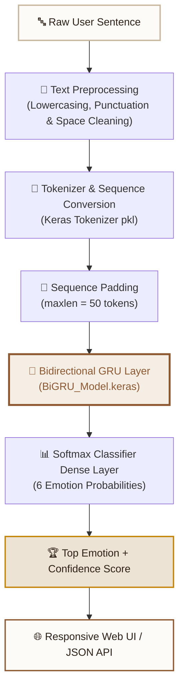

<div align="center">

# 🎭 SADEP — Sentiment Analysis & Deep Emotion Prediction

<!-- Typing SVG Animation -->
<a href="https://git.io/typing-svg">
  
</a>

<p align="center">
  <em>An intelligent neural instrument that reads subtle psychological mood and emotion within sentences in real time.</em>
</p>

<!-- Animated & Interactive Status Badges -->
<p align="center">
  
  
  
  
  
</p>

<p align="center">
  <a href="#-features">Features</a> •
  <a href="#-architecture">Architecture</a> •
  <a href="#-live-ui-experience">UI Experience</a> •
  <a href="#-quickstart">Quickstart</a> •
  <a href="#-api-reference">API Reference</a> •
  <a href="#-author">Author</a>
</p>

---

</div>

## 🌟 Highlights & Features

<table>
  <tr>
    <td width="50%">
      <h3>🧠 BiGRU Deep Learning Engine</h3>
      <ul>
        <li>Reads sentences simultaneously in forward & backward context</li>
        <li>Tokenized & padded embedding sequence representations</li>
        <li>Multi-class softmax probability distribution across 6 core emotions</li>
        <li>Trained on rich emotional linguistic datasets</li>
      </ul>
    </td>
    <td width="50%">
      <h3>🎨 Warm Editorial Aesthetic</h3>
      <ul>
        <li>Warm organic linen beige (<code>#f4eee5</code>) & ivory cards</li>
        <li>Rich espresso brown (<code>#2c2017</code>) & bronze accents</li>
        <li>Hero header featuring <strong>Syne</strong> typography with metallic shimmer animation</li>
        <li>Ambient floating emotion drift capsules in the empty margins</li>
      </ul>
    </td>
  </tr>
  <tr>
    <td width="50%">
      <h3>⚡ High-Performance FastAPI API</h3>
      <ul>
        <li>Sub-50ms inference latency on CPU</li>
        <li>Async lifecycle model loader (loaded once in memory)</li>
        <li>Interactive Swagger API documentation (<code>/docs</code>)</li>
        <li>Robust Pydantic v2 input validation & schema enforcement</li>
      </ul>
    </td>
    <td width="50%">
      <h3>✨ Dynamic Interactive Experience</h3>
      <ul>
        <li><strong>Click-to-Try</strong> floating mood nodes on left & right</li>
        <li>Real-time morphing neural orb with emotion feedback</li>
        <li>Active resonance glow highlighting recognized emotions</li>
        <li>Animated breakdown progress meters for all 6 emotions</li>
      </ul>
    </td>
  </tr>
</table>

---

## 🎭 The 6 Emotion Spectrum

| Emotion | Glyph | Valence / Arousal | Signature Color | Example Sentence |
| :--- | :---: | :--- | :---: | :--- |
| **Joy** | 😄 | Positive / Moderate | `#c48200` | *"I am so incredibly happy and proud of what we accomplished!"* |
| **Love** | ❤️ | Positive / Deep Warmth | `#cb3d62` | *"Every time I think about that beautiful fireplace, I am flooded with a deep, loving nostalgia for the comfort we shared."* |
| **Surprise**| 😲 | Ambivalent / High Arousal | `#0d8b7d` | *"I was shocked and completely surprised by the unexpected gift!"* |
| **Sadness** | 😢 | Negative / Low Energy | `#3d65ce` | *"I feel so alone and hopeless today."* |
| **Fear** | 😨 | Negative / High Arousal | `#7242b5` | *"I feel terrified when walking down dark alleyways alone."* |
| **Anger** | 😠 | Negative / High Intensity | `#c8461d` | *"I am furious that they cancelled the trip at the last minute."* |

---

## 🏛️ Architecture & Inference Pipeline



---

## 💻 Quickstart Guide

### 1. Prerequisites
- **Python 3.10+** (Tested on Python 3.11, 3.12, and 3.13)
- `pip` or `conda`

### 2. Clone the Repository
```bash
git clone https://github.com/rahulkhawashi/SADEP-Sentiment-Analysis-and-Deep-Emotion-Prediction.git
cd SADEP-Sentiment-Analysis-and-Deep-Emotion-Prediction
```

### 3. Install Dependencies
```bash
pip install -r requirements.txt
```

### 4. Run the FastAPI Server
```bash
python -m uvicorn main:app --port 8000 --reload
```

Open your browser and navigate to:
👉 **`http://127.0.0.1:8000`**

---

## 📡 API Reference

<details>
<summary><b>🔍 POST /predict — Predict Emotion (Click to Expand)</b></summary>
<br>

**Request:**
```http
POST /predict HTTP/1.1
Host: 127.0.0.1:8000
Content-Type: application/json

{
  "text": "Every time I think about that beautiful fireplace, I am flooded with a deep, loving nostalgia for the comfort we shared."
}
```

**cURL Example:**
```bash
curl -X POST "http://127.0.0.1:8000/predict" \
     -H "Content-Type: application/json" \
     -d '{"text": "Every time I think about that beautiful fireplace, I am flooded with a deep, loving nostalgia for the comfort we shared."}'
```

**Response (`200 OK`):**
```json
{
  "text": "Every time I think about that beautiful fireplace, I am flooded with a deep, loving nostalgia for the comfort we shared.",
  "predicted_emotion": "love",
  "confidence": 0.9271,
  "all_probabilites": {
    "love": 0.9271,
    "anger": 0.0286,
    "joy": 0.0276,
    "sadness": 0.0083,
    "fear": 0.0080,
    "surprise": 0.0004
  }
}
```

</details>

<details>
<summary><b>💓 GET /health — Health Check (Click to Expand)</b></summary>
<br>

**Response (`200 OK`):**
```json
{
  "status": "Server is running",
  "model_loaded": true
}
```

</details>

<details>
<summary><b>📖 Interactive Swagger Documentation</b></summary>
<br>

Access the interactive API documentation directly in your browser:
- Swagger UI: `http://127.0.0.1:8000/docs`
- ReDoc: `http://127.0.0.1:8000/redoc`

</details>

---

## 🎨 Design System & Aesthetics

```
├── Color Tokens
│   ├── --bg: #f4eee5             (Warm Linen Beige)
│   ├── --surface: #fdfbf7        (Warm Ivory Cream)
│   ├── --surface-2: #ede3d5      (Toasted Sand Beige)
│   ├── --border: #dfd2bf         (Almond Taupe Border)
│   ├── --text: #2c2017           (Espresso Dark Brown)
│   ├── --text-dim: #685547       (Roasted Coffee Brown)
│   └── --accent: #8e5831         (Saddle Leather Bronze)
│
├── Typography
│   ├── Display Heading: "Syne", sans-serif (800 Weight)
│   ├── Emotion Word: "Fraunces", serif (Italicized)
│   ├── Body Copy: "Space Grotesk", sans-serif
│   └── Metrics: "JetBrains Mono", monospace
│
└── Animations
    ├── Shimmer-Flow: Metallic bronze/amber flowing gradient
    ├── Emotion-Drift: Harmonic floating mood capsules
    └── Neural-Orb: Morphing shape with breathing aura
```

---

## 📁 Project Structure

```
Emotion-Prediction/
├── Artifacts/
│   ├── BiGRU_Model.keras     # Trained Bidirectional GRU neural network
│   └── tokenizer.pkl         # Keras Tokenizer vocabulary dictionary
├── static/
│   ├── index.html            # Semantic HTML5 frontend with floating drift field
│   ├── script.js             # Vanilla JS state management & asynchronous API client
│   └── style.css             # Vanilla CSS design tokens, animations & responsive layout
├── main.py                   # FastAPI backend, lifespan manager & inference routes
├── emotion_preds.ipynb       # Model exploration & training notebook
├── requirements.txt          # Python dependencies
├── runtime.txt               # Python runtime specification
└── README.md                 # Interactive documentation
```

---

## 👨‍💻 Author

<div align="center">

**Rahul Khawshi**

[](mailto:khawashirahul@gmail.com)
[](https://www.linkedin.com/in/rahulkhawshi)

*Crafted with passion for Deep Learning and Human-Centered Design.*

</div>
